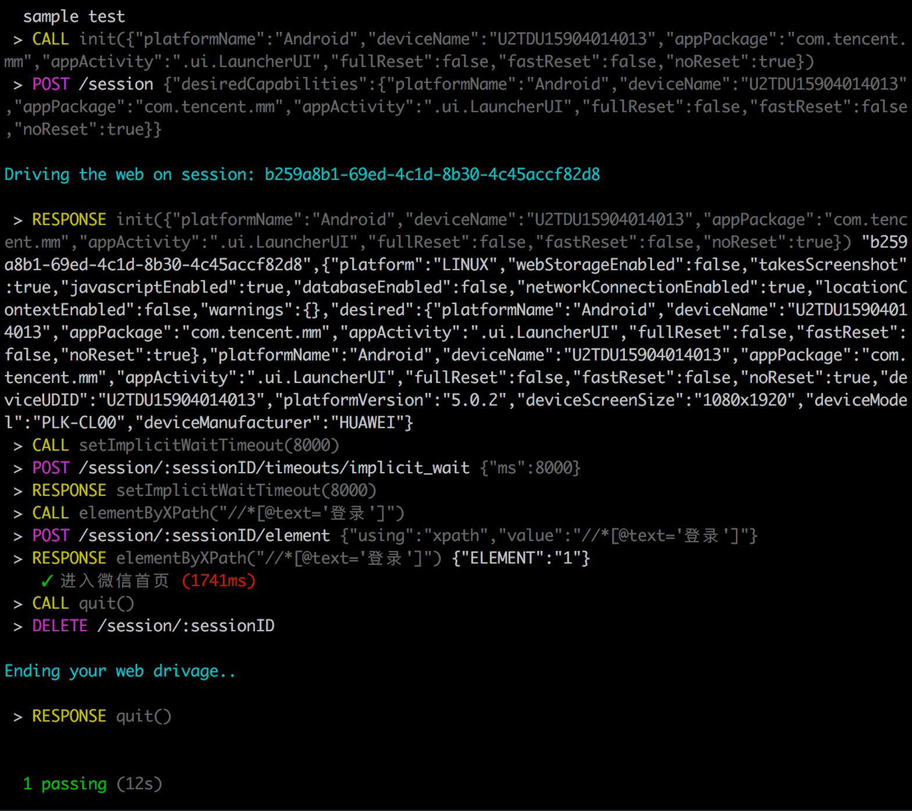

# 使用 node（wd）编写 Appium 测试用例

[wd](https://github.com/admc/wd) 是Appium服务器的JavaScript语言的客户端程序库，支持使用node编写Appium测试用例

在编写测试用例前，确保电脑已搭建好Appium环境，若未搭建，参考：[Mac系统下appium环境搭建](https://github.com/HuJiaoHJ/blog/issues/1)

## 搭建测试项目

### 新建项目

``` bash
$ mkdir appium-wd-example
$ cd appium-wd-example
$ npm init
```

### 安装 appium 客户端程序库

``` bash
$ npm install wd # wd是Appium服务器的JavaScript语言的客户端程序库
```

### 安装 mocha 测试框架及其他依赖

``` bash
$ npm install mocha # 测试框架
$ npm install chai
$ npm install chai-as-promised
$ npm install colors
```

### 编写测试用例

#### 测试功能

进入微信首页（未登录状态），检查是否存在登录按钮

#### 准备

Android机（安装了微信）、数据线（将手机通过数据线与电脑连接）

#### 获取设备信息

##### deviceName

``` bash
$ adb devices
# List of devices attached
# U2TDU15904014013	device
```

##### appPackage & appActivity

在测试机上，打开微信，执行以下脚本：

``` bash
$ adb shell dumpsys window windows | grep mFocusedApp
# mFocusedApp=AppWindowToken{1c6b43b3 token=Token{49ad22 ActivityRecord{35092aed u0 com.tencent.mm/.ui.LauncherUI t224}}}
```

从输出可以获取到 appPackage: "com.tencent.mm"; appActivity: ".ui.LauncherUI"

配置：[Appium Desired Capabilities](https://appium.io/docs/en/writing-running-appium/caps/)

#### 写代码

**sample.js**

``` javascript
require("../helpers/setup");

const wd = require("wd");

const serverConfig = {
    host: 'localhost',
    port: 4723
};

describe("sample test", function () {
    this.timeout(300000);

    let driver;
    let allPassed = true;

    before(function () {

        driver = wd.promiseChainRemote(serverConfig);
        require("../helpers/logging").configure(driver);

        var desired = {
            platformName: 'Android',
            deviceName: 'U2TDU15904014013',
            appPackage: 'com.tencent.mm',
            appActivity: '.ui.LauncherUI',
            fullReset: false,
            fastReset: false,
            noReset: true,
        };
        return driver
            .init(desired)
            .setImplicitWaitTimeout(8000);
    });

    after(function () {
        return driver
            .quit();
    });

    afterEach(function () {
        allPassed = allPassed && this.currentTest.state === 'passed';
    });

    it("进入微信首页", function () {
        return driver
            .elementByXPath("//*[@text='登录']")
            .should.eventually.exist;
    });
});
```

**setup.js**

``` javascript
const wd = require("wd");

require('colors');
const chai = require("chai");
const chaiAsPromised = require("chai-as-promised");
chai.use(chaiAsPromised);
const should = chai.should();
chaiAsPromised.transferPromiseness = wd.transferPromiseness;

exports.should = should;
```

**logging.js**

``` javascript
exports.configure = function (driver) {
    driver.on('status', function (info) {
        console.log(info.cyan);
    });
    driver.on('command', function (meth, path, data) {
        console.log(' > ' + meth.yellow, path.grey, data || '');
    });
    driver.on('http', function (meth, path, data) {
        console.log(' > ' + meth.magenta, path, (data || '').grey);
    });
};
```

### 执行测试用例

在**package.json**中添加以下脚本：

``` javascript
{
    ...
    "scripts": {
        "sample": "mocha ./test/sample.js"
    }
    ...
}
```

执行测试用例：

``` bash
$ appium # 启动Appium服务
$ npm run sample # 运行测试用例
```

执行结果如下：

<p align="left">
    
</p>

以上就是使用 wd 编写简单 Appium 测试用例的过程了~

使用 wd 编写复杂测试用例，参考：[使用 Appium 进行微信小程序自动化测试](https://github.com/HuJiaoHJ/blog/issues/5)

完整代码：https://github.com/HuJiaoHJ/appium-wd-example