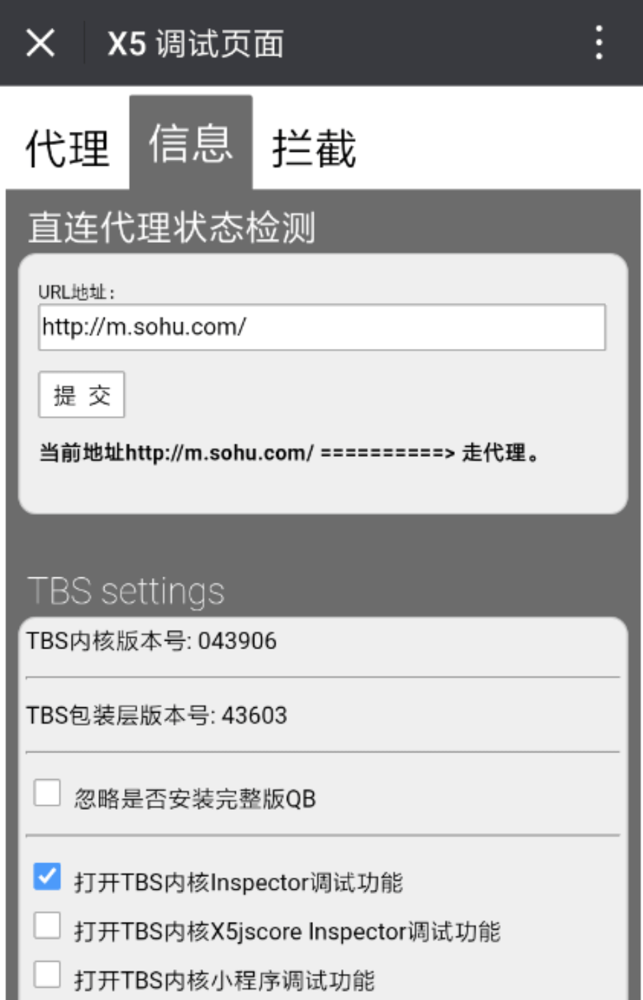
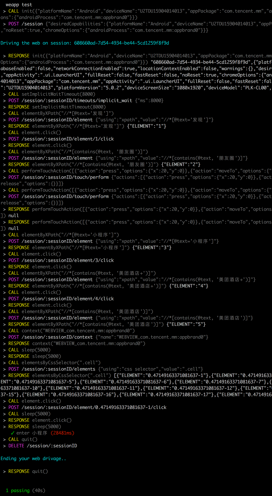

# 使用 Appium 进行微信小程序自动化测试

[使用 node（wd）编写 Appium 测试用例](https://github.com/HuJiaoHJ/blog/issues/3) 介绍了使用 [wd](https://github.com/admc/wd) 编写简单的 Appium 测试用例

本文主要介绍使用 Appium 进行微信小程序自动化测试，涉及使用 wd 编写复杂 Appium 测试用例以及微信 webview 自动化测试。

测试项目搭建及简单前期准备参考[使用 node（wd）编写 Appium 测试用例](https://github.com/HuJiaoHJ/blog/issues/3)

其实微信小程序就是webview，所以可以使用webview测试方式进行小程序的测试。

### 打开微信调试功能

用微信打开[http://debugx5.qq.com](http://debugx5.qq.com)页面，或者直接打开二维码：

<p align="left">
    
</p>

勾选【打开TBS内核Inspector调试功能】，如下：

<p align="left">
    
</p>

设置好之后，就可以在chrome浏览器中打开[chrome://inspect/](chrome://inspect/)页面查看当前微信中打开的H5页面了

### 在电脑中安装chromedriver

安装Appium时，会自动安装chromedriver，但是在使用默认安装的chromedriver时，对于一些老设备会存在一些问题，报类似下面这样的错误：

```
An unknown server-side error occurred while processing the command.
Original error: unknown error: Chrome version must be >= 55.0.2883.0
```

解决办法可以参考[官方文档](https://github.com/appium/appium/blob/master/docs/en/writing-running-appium/web/chromedriver.md)

我使用的测试机chrome版本是59.0.3071.0，所以直接下载 v2.32 版本的 chromedriver 到 /usr/local/ 目录下，在启动Appium时，通过 `--chromedriver-executable` 指定使用此chromedriver，如下：

``` bash
$ appium --chromedriver-executable /usr/local/chromedriver
```

### 编写测试用例

以测试【美团酒店+】小程序为例，测试代码如下：（ setup.js、logging.js 参考[使用 node（wd）编写 Appium 测试用例](https://github.com/HuJiaoHJ/blog/issues/3)）

**weapp.js**

``` javascript
require("../helpers/setup");

const wd = require("wd");

const serverConfig = {
    host: 'localhost',
    port: 4723
};

describe("weapp test", function () {
    this.timeout(300000);

    let driver;
    let allPassed = true;

    before(function () {
        
        driver = wd.promiseChainRemote(serverConfig);
        require("../helpers/logging").configure(driver);

        let desired = {
            platformName: 'Android',
            deviceName: 'U2TDU15904014013',
            appPackage: 'com.tencent.mm',
            appActivity: '.ui.LauncherUI',
            fullReset: false,
            fastReset: false,
            noReset: true,
            chromeOptions: {
                androidProcess: 'com.tencent.mm:appbrand0',
            }
        };
        return driver
            .init(desired)
            .setImplicitWaitTimeout(8000);
    });

    after(function () {
        return driver
            .quit();
    });

    afterEach(function () {
        allPassed = allPassed && this.currentTest.state === 'passed';
    });

    it("enter 小程序", function () {
        return driver
            .elementByXPath("//*[@text='发现']")
            .click()
            .elementByXPath("//*[contains(@text, '朋友圈')]")
            .then(function () {
                let action = new wd.TouchAction(driver);
                action.press({x: 20, y: 0}).moveTo({x: 20, y: 20}).wait(200).release().perform();
                return driver.performTouchAction(action);
            })
            .elementByXPath("//*[@text='小程序']")
            .click()
            .elementByXPath("//*[contains(@text, '美团酒店+')]")
            .click()
            .elementByXPath("//*[contains(@text, '美团酒店')]")
            .should.eventually.exist
            .context('WEBVIEW_com.tencent.mm:appbrand0')
            .sleep(5000)
            .elementsByCssSelector('.cell', function (err, els) {
                els[0].click();
            })
            .sleep(5000);
    });
});
```

### 执行测试用例

在**package.json**中添加以下脚本：

``` javascript
{
    ...
    "scripts": {
        "weapp": "mocha ./test/weapp.js"
    }
    ...
}
```

执行测试用例：

``` bash
$ appium --chromedriver-executable /usr/local/chromedriver # 启动Appium服务且指定chromedriver
$ npm run weapp # 运行测试用例
```

执行结果如下：

<p align="left">
    
</p>

以上就是使用 Appium 进行微信小程序自动化测试~

完整代码：https://github.com/HuJiaoHJ/appium-wd-example

#### 经过一系列的实践之后，发现使用 Appium 进行微信小程序自动化测试依旧还存在以下几个问题：

1、微信在6.5.23版本之后在使用 `driver.context(WEBVIEW_com.tencent.mm:appbrand0)` 时，获取的 https://servicewechat.com/{appid}/{version}/page-frame.html 中body为空，而页面内容都包含在 https://servicewechat.com/preload/page-frame.html ，而在切换时，随机获取两个html中一个，所以会存在获取到空内容的情况。（微信社区问题：https://developers.weixin.qq.com/blogdetail?action=get_post_info&lang=zh_CN&token=1707682624&docid=a85a5892193727a1954ccf55198c77d2&comment_lvl=1 ）

2、在小程序内部进行页面跳转之后，webview之间的相互切换暂时是存在问题的，原因还是上面提到的两个html的原因，暂时没有找到解决办法。（社区问题：https://testerhome.com/topics/7769 ）

所以，大概在17年12月更新的版本之后，还是不要再考虑使用 Appium 进行微信小程序的自动化测试了，网上很多教程都是在17年12月之前的，所以能走通整个流程，但是现在是存在问题的

欢迎找到解决办法的小伙伴分享一下~~~

写在最后：从调研到得出最终结论，花了差不多一周的时间，中间还经历了一个春节。虽然最后此方案没能用在实际开发中，有点遗憾，不过整个过程还是收获不少~~~