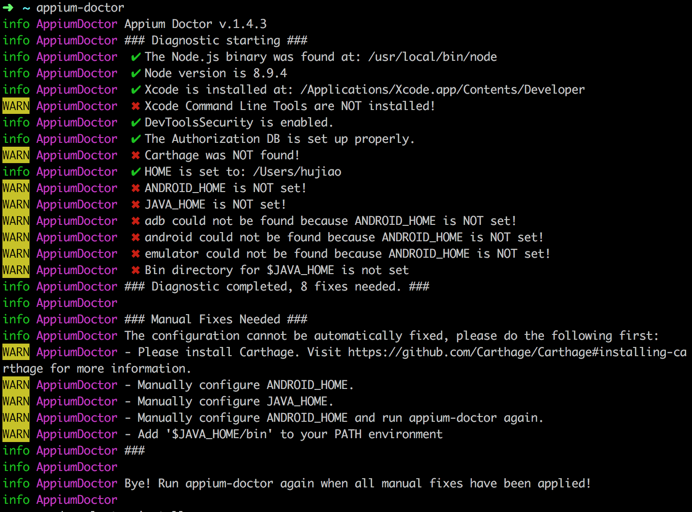
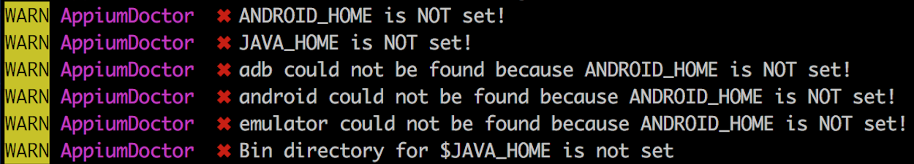
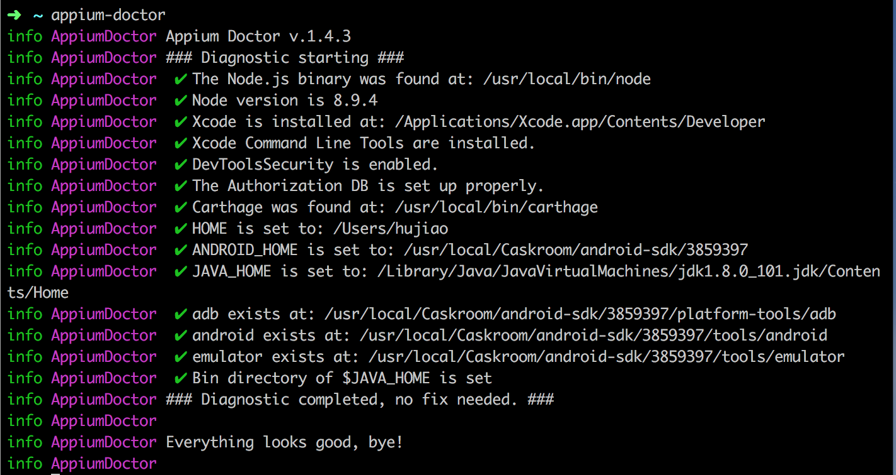

# Mac系统下appium环境搭建

前期准备：

* Java环境（mac自带）
* homebrew，安装方法：https://brew.sh/index.html
* node、npm，可以使用homebrew安装

## 安装appium

使用npm安装：

``` bash
$ npm install -g appium # get appium
```
安装成功之后，执行：

``` bash
$ appium # start appium
```

## 安装appium-doctor

使用npm安装

``` bash
$ npm install -g appium-doctor
```

安装完成之后，执行 `appium-doctor` 检查 appium 环境，如下：

<p align="left">
    
</p>

可以看到，当前环境还没有完全搭建完成，常见问题解决：

<p align="left">
    
</p>

解决：

``` bash
$ xcode-select --install # 按照提示安装即可
```

<p align="left">
    
</p>

解决：

``` bash
$ brew install carthage
```

<p align="left">
    
</p>

解决 `JAVA_HOME is NOT set!` `Bin directory for $JAVA_HOME is not set` 问题：

``` bash
$ vi ~/.bash_profile
```

添加以下配置：

```
export JAVA_HOME=$(/usr/libexec/java_home)
export PATH=$PATH:${JAVA_HOME}/bin 
```

解决 `$ANDROID_HOME` 一系列问题：

<strong>安装 android-sdk</strong>

使用brew安装：

``` bash
$ brew cask install android-sdk
$ brew cask install android-platform-tools
$ /usr/local/Caskroom/android-sdk/3859397/tools/android update sdk --use-sdk-wrapper # 3859397 是安装的 android-sdk 的版本
```

检测是否安装成功：

``` bash
$ cd /usr/local/Caskroom/android-sdk/ # 检测该目录是否存在
$ cd 3859397/ # 去到 android-sdk/ 目录下的子目录，不同版本文件夹名称不同
$ ll # 改目录下要存在 tools、platform-tools、build-tools 三个文件夹，否则这个环境还是会存在问题的；如果没有 platform-tools 文件夹，可以将 /usr/local/Caskroom/android-platform-tools/27.0.1/ 目录下的 platform-tools 文件夹复制过来
```

安装成功之后，在 `~/.bash_profile` 中添加以下配置：

```
export ANDROID_HOME=/usr/local/Caskroom/android-sdk/3859397
export PATH=$PATH:$ANDROID_HOME/tools:$ANDROID_HOME/platform-tools
```

最后，`~/.bash_profile` 文件配置如下：

```
export JAVA_HOME=$(/usr/libexec/java_home)
export ANDROID_HOME=/usr/local/Caskroom/android-sdk/3859397
export PATH=$PATH:$ANDROID_HOME/tools:$ANDROID_HOME/platform-tools:${JAVA_HOME}/bin
```

执行：

``` bash
$ source ~/.bash_profile
```

再次执行 `appium-doctor` 检查 appium 环境，如下：

<p align="left">
    
</p>

以上，appium 环境就搭建完成~
