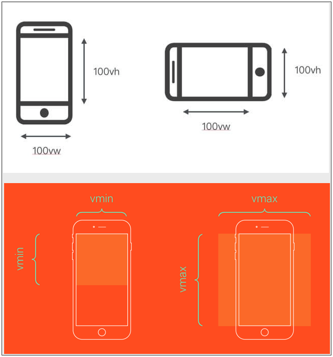
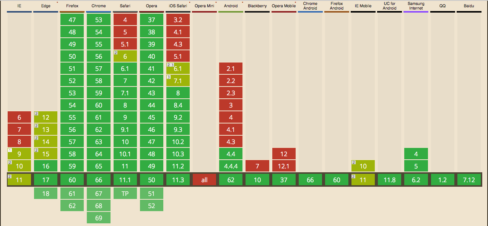

## 移动端布局

移动端布局范畴很广，其中比较基础的几个话题：

* 移动端适配
* 1px border
* 基础布局

本文主要分享这三个话题

### 一、移动端适配

提起移动端适配，大家想到的肯定是`rem`、`flexible.js`，本文要分享的方案是 `vw + rem`

对移动端适配不熟悉的同学，可以看看：

* [使用Flexible实现手淘H5页面的终端适配](http://www.w3cplus.com/mobile/lib-flexible-for-html5-layout.html)
* [再聊移动端页面的适配](https://www.w3cplus.com/css/vw-for-layout.html)
* [如何在Vue项目中使用vw实现移动端适配](https://www.w3cplus.com/mobile/vw-layout-in-vue.html)

#### vw 是什么？

vw 是基于视图(Viewport)的长度单位，而与Viewport相关四个单位有：

* vw：Viewport's Width 简写，1vw 等于 window.innerWidth 的 1%
* vh：Viewport's Height 简写，1vh 等于 window.innerHeight 的 1%
* vmin：当前 vw 和 vh 中较小值
* vmax：当前 vw 和 vh 中较大值

<p align="left">
    
</p>

常规的 rem 的适配方案（包括flexible），其实就是通过 js 动态计算，模拟 vw 的效果，过去使用这种方案主要原因是 vw 存在一定的兼容问题，不过对于现在而言，vw 也基本能满足对兼容性的要求

<p align="left">
    
</p>

可以看到，Android 4.4 以上及 IOS 8.0 以上均已支持，所以现在我们可以直接使用 vw 来做移动端适配啦

#### vw + rem 方案

##### 1、设置 html font-size 为 10vw

```CSS
html {
    font-size: 10vw;
}
```

##### 2、以750UI图为例，在 css 中，直接使用UI图上的长度值，单位设置为 px

```CSS
.head {
    width: 750px;
}
```

##### 3、引入 [postcss-pxtorem](https://github.com/cuth/postcss-pxtorem#readme) 插件，配置如下：

```JavaScript
require('postcss-pxtorem')({
    rootValue: 75,
    unitPrecision: 5,
    propList: ['*'],
    selectorBlackList: [],
    replace: true,
    mediaQuery: false,
    minPixelValue: 0
})
```

以上，就可以使用了 vw + rem 方案实现了移动端适配

##### 4、引入 [viewport-units-polyfill](https://github.com/HuJiaoHJ/viewport-units-polyfill) 解决兼容问题

为了保证在低版本的机型也能正常显示页面，可以引入 viewport-units-polyfill 来处理 vw 的兼容问题。

viewport-units-polyfill 其实是 [viewport-units-buggyfill](https://github.com/rodneyrehm/viewport-units-buggyfill) 的简化版。

简单介绍下 viewport-units-buggyfill 的实现思路：通过引入一段js，对于存在兼容问题的版本，遍历页面中所有的css，找到用到Viewport单位的css，将Viewport单位计算为 px 单位，并将新的css规则插到head或body中。

viewport-units-polyfill 则是在 viewport-units-buggyfill 基础上做了些修改，主要是把大量的遍历工作去掉，只针对 html font-size 做兼容处理（此适配方案只在 html font-size 中使用到vw）。去掉遍历工作，大大优化了性能。

用法：直接将此 js 脚本放在页面的 head 中即可

### 二、1px border

网上对 1px border 问题的解决方案很多，可以看看：[再谈Retina下1px的解决方案](https://www.w3cplus.com/css/fix-1px-for-retina.html)

本文分享的方案则是在使用 vw + rem 的适配方案基础上，使用视图缩放（Viewport scale）来解决 1px border 问题

#### 实现

```JavaScript
(function () {
    var dpr = window.devicePixelRatio;
    var scale = 1 / dpr;

    var metaEl = document.querySelector('meta[name="viewport"]') || document.createElement('meta');
    metaEl.setAttribute('name', 'viewport');
    metaEl.setAttribute('content', 'width=device-width, initial-scale=' + scale + ', maximum-scale=' + scale + ', minimum-scale=' + scale + ', user-scalable=no, viewport-fit=cover');

    if (document.documentElement.firstElementChild) {
        document.documentElement.firstElementChild.appendChild(metaEl);
    } else {
        var wrap = document.createElement('div');
        wrap.appendChild(metaEl);
        document.write(wrap.innerHTML);
    }
})();
```

思路很简单，就是讲视图缩放（Viewport scale）设置为 1/dpr（设备像素比）,从而解决 1px border 的问题

注意：此脚本是简单版，经过对各种品牌、机型进行测试之后发现，此方案基本表现良好，只有对于魅族几款手机，会存在border过细的问题。原因主要是魅族的手机 dpr 是3，但是屏幕真实分辨率并不高（我个人的理解，并未得到数据上的证实，感兴趣的小伙伴可以去验证），从而视图缩放过多，导致border过细，解决方式则是通过hack的方式（暂时没有想到比较好的，有其他方式的小伙伴欢迎评论交流~）

```JavaScript
(function () {
    // 1px
    var dpr = window.devicePixelRatio;
    var isIPhone = window.navigator.appVersion.match(/iphone/gi);
    var UA = window.navigator.userAgent;
    // 对 meizu 某型号进行hack，主要原因是 dpr为3，但是手机屏幕分辨率不够，会出现 1px border 过细的问题，这种问题主要出现在部分魅族手机上
    var hacks = ['m1 note'];
    var flag = false;
    hacks.forEach(function (item) {
        if (UA.indexOf(item) >= 0) {
            flag = true;
            return;
        }
    });
    if (!isIPhone && flag) {
        dpr = dpr >= 2 ? 2 : dpr;
    }
    var scale = 1 / dpr;
    var metaEl = document.querySelector('meta[name="viewport"]') || document.createElement('meta');
    metaEl.setAttribute('name', 'viewport');
    metaEl.setAttribute('content', 'width=device-width, initial-scale=' + scale + ', maximum-scale=' + scale + ', minimum-scale=' + scale + ', user-scalable=no, viewport-fit=cover');

    if (document.documentElement.firstElementChild) {
        document.documentElement.firstElementChild.appendChild(metaEl);
    } else {
        var wrap = document.createElement('div');
        wrap.appendChild(metaEl);
        document.write(wrap.innerHTML);
    }
})();
```

将上面的脚本放在页面head中，在开发 1px border 时，可以直接如下：

```CSS
.border {
    border-bottom: 1PX solid #eee;
}
```

注意：如果使用了 postcss-pxtorem 类似插件，需要注意不能将此 1px 单位转换成 rem，我使用的方法是不需要转换的 px 使用大写 PX，这样 postcss-pxtorem 就不会转换

### 三、基础布局

基础布局其实涵盖很多方面，如：

* 页面整体布局
* 文案与icon
    * 各种居中对齐（垂直、水平）
    * 文案与icon对齐（icon应该使用iconfont而不是图片）
* z-index 分层

#### 1、页面整体布局

H5页面比较常见的布局是页面分为三部分：head、body、foot，其中head、foot会有吸顶、吸底的效果，常规的使用 fixed布局 会存在些问题，推荐将页面整体使用flex布局，将head、foot固定，body可滚动，如下：

```HTML
<div id="page">
    <div id="hd">
        <!-- head -->
    </div>
    <div id="bd">
        <!-- body -->
    </div>
    <div id="ft">
        <!-- foot -->
    </div>
</div>
```

```SCSS
#page {
    display: flex;
    flex-direction: column;
    position: relative;
    height: 100%;
    overflow: hidden;
}
#hd {
    z-index: 999;
}
#bd {
    flex-grow: 1;
    overflow-y: scroll;
    -webkit-overflow-scrolling: touch;
    &::-webkit-scrollbar {
        display: none;
    }
}
```

#### 2、文案和icon

##### 使用iconfont

http://www.iconfont.cn/

注意：iconfont不支持多色icon，所以多色icon可以考虑使用svg或者img

##### 垂直水平居中

实现方案很多：https://css-tricks.com/centering-css-complete-guide/，建议使用flex布局

##### 文案与icon对齐

```HTML
<div class="box">
    <span>文案与icon垂直居中，水平对齐</span>
    <span class="icon-span">
        <i class="icons">&#xe625;</i>
    </span>
</div>
```

```SCSS
.box {
    height: 92px;
    font-size: 32px;
    line-height: 1;
    padding: 0 20px;
    display: flex;
    align-items: center;
    .icon-span {
        font-size: 24px;
        line-height: 1;
        .icons {
            color: red;
            margin-left: 8px;
        }
    }
}
```

#### 3、z-index 分层

规范 z-index 的使用，防止因滥用导致在页面展示问题，分层使用：

```SCSS
$z-layers: ( 
    'below': -1,
    'default': 1,
    'content': (
        'base': 100
    ),
    'fixed': 990,
    'mask': 1000,
    'modal': 1020,
    'toast': 1040
);
```

为了方便使用，使用以下 scss 方法：

```SCSS
$z-layers: ( 
    'below': -1,
    'default': 1,
    'content': (
        'base': 100
    ),
    'fixed': 990,
    'mask': 1000,
    'modal': 1020,
    'toast': 1040
);
@function map-has-nested-keys($map, $keys...) {
    @each $key in $keys {
        @if not map-has-key($map, $key) {
            @return false;
        }
        $map: map-get($map, $key);
    }
    @return true;
}

@function map-deep-get($map, $keys...) {
    @each $key in $keys {
        $map: map-get($map, $key);
    }
    @return $map;
}

@function z($layers...) {
    @if not map-has-nested-keys($z-layers, $layers...) {
        @warn "No layer found for `#{inspect($layers...)}` in $z-layers map. Property omitted.";
    }
    @return map-deep-get($z-layers, $layers...);
}
```

具体使用如下：

```SCSS
.head {
    z-index: z('fixed');
}
```

以上讲的布局，可以去 [DEMO页](https://hujiaohj.github.io/h5-layout/build/pages/vw_layout/index.html)看看，二维码：

<p align="left">
    
</p>

代码：https://github.com/HuJiaoHJ/h5-layout

以上说的方案，我在现在几款主流的手机上都进行了测试，基本表现良好（主要问题在于 1px border 在魅族机型上展示过细）

### 写在最后

本文分享的方案都是我在平时工作中用到的，希望能对有需要的小伙伴有帮助~~~
