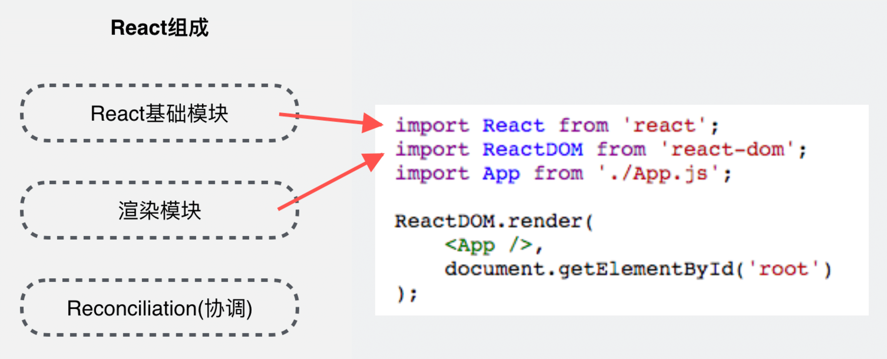
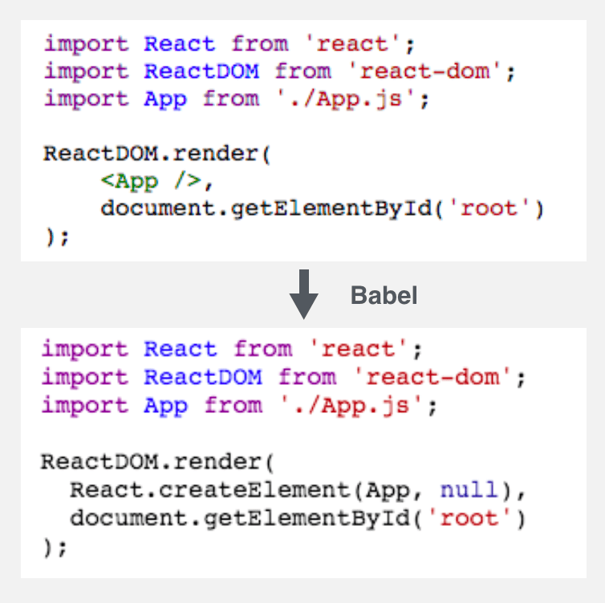

## React16源码分析之 React Fiber 架构

> 本文源码是2018年8月10日拉取的React仓库master分支上的代码

React源码分析内容非常多，本文专注在以下两个问题：

* JSX -> ? -> DOM
* React Component 的生命周期函数是怎么被调用的？

在开始源码分析之前，首先先简单介绍一下React的一些基础概念

### 基础概念

React定位是一个构建用户界面的JavaScript类库，使用JavaScript开发UI组件，支持多种方式渲染组件，输出用户界面。

而现在React最流行的是三种应用：

* React Web 应用
* React Native 应用
* React服务端渲染

这三种应用分别对应三种不同的渲染方式：

* Web DOM 渲染
* 客户端原生 View 渲染
* 服务端字符串渲染

下面，以 React Web应用 为例，介绍下React三个主要组成部分：

* React基础模块（这个模块定义了React的基础API及组件相关内容。对应我们开发页面时引入的 'react' 模块）
* 渲染模块（这个模块对于不同类型的应用，采用不同的渲染方式。对应我们开发页面时引入的 'react-dom' 模块）
* Reconciliation 模块（又叫 协调模块，这个模块是上面两个模块的基础，也是本文分享的重点，主要负责任务协调、生命周期函数管理等）

<p align="left">
    
</p>

在开始 Reconciliation 模块之前，先简单介绍各个模块：

#### React基础模块

```JavaScript
const React = {
  Children: {...},

  createRef,
  Component,
  PureComponent,

  createContext,
  forwardRef,

  Fragment: REACT_FRAGMENT_TYPE,
  StrictMode: REACT_STRICT_MODE_TYPE,
  unstable_AsyncMode: REACT_ASYNC_MODE_TYPE,
  unstable_Profiler: REACT_PROFILER_TYPE,

  createElement,
  cloneElement,
  createFactory,
  isValidElement,

  version: ReactVersion,

  __SECRET_INTERNALS_DO_NOT_USE_OR_YOU_WILL_BE_FIRED: ReactSharedInternals,
};
```

从上面的源码可以看到，React基础模块只包括了基础的API和组件相关的定义。如：createRef、Component等。

其中可以重点关注的两点：

##### 1、React.creatElement

在平时的开发中，我们使用的JSX语法，所以我们并没有直接接触到 React.creatElement 方法

大家都知道，JSX语法会被babel编译成调用 React.creatElement 方法，如下：

<p align="left">
    
</p>

而 React.creatElement 最终返回的是 React Element，如下：

```JavaScript
{
    $$typeof: REACT_ELEMENT_TYPE,
    type: type,
    key: key,
    ref: ref,
    props: props,
    _owner: owner,
}
```

可以在页面中把 <App/> 打印出来看下，如下：


##### 2、React.component

组件是我们开发使用最多的，我们可以简单的看下源码：

```JavaScript

```


