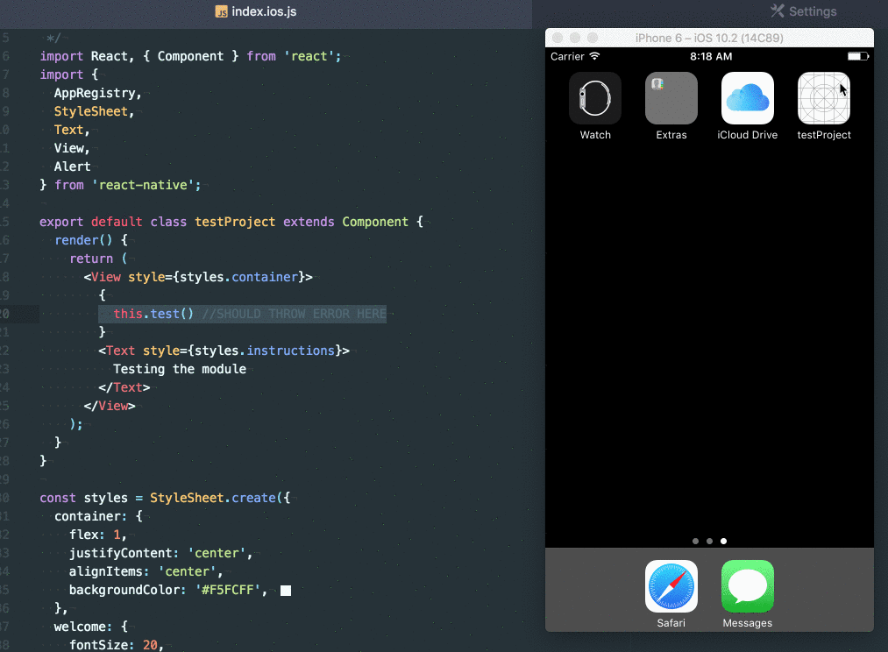
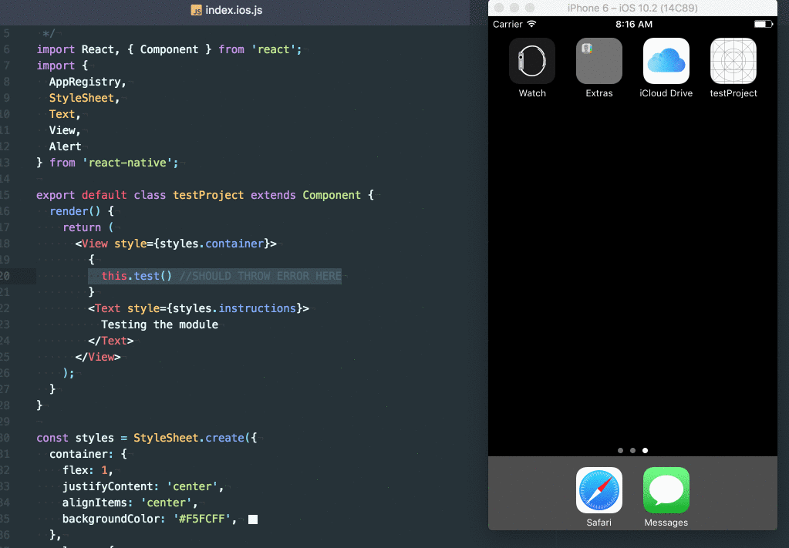
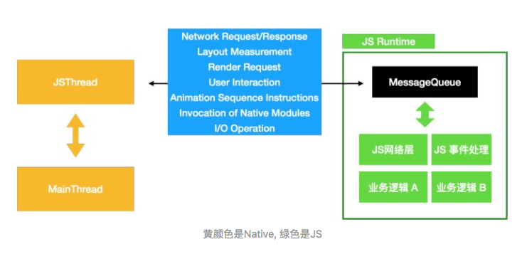

# React Native 异常处理

React Native页面出现错误时：

1、开发模式下，会出现红色背景的页面，展示当前代码错误信息，如下：



2、bundle模式下，则会出现白屏或者闪退，如下：



在生产环境下，因RN页面异常导致整个APP白屏或者闪退，用户体验并不好，所以应该对异常进行捕获并处理，提高用户体验

主要使用两种方法对RN页面的异常进行捕获并处理：

1、React Error Boundaries (异常边界组件)

2、React Native ErrorUtils

## React Error Boundaries (异常边界组件)

React Error Boundaries (异常边界组件)是React 16 引入的新概念，为了避免React的组件内的UI异常导致整个应用的异常

对React的异常边界组件不熟悉的小伙伴可以看看我的文章：[从源码看React异常处理](https://github.com/HuJiaoHJ/blog/issues/12)

这里简单介绍下：

Error Boundaries（异常边界）是React组件，用于捕获它子组件树种所有组件产生的js异常，并渲染指定的兜底UI来替代出问题的组件

它能捕获子组件生命周期函数中的异常，包括构造函数（constructor）和render函数

而不能捕获以下异常：

* Event handlers（事件处理函数）
* Asynchronous code（异步代码，如setTimeout、promise等）
* Server side rendering（服务端渲染）
* Errors thrown in the error boundary itself (rather than its children)（异常边界组件本身抛出的异常）

所以可以通过异常边界组件捕获组件生命周期内的所有异常并渲染兜底UI，防止APP白屏或闪退，提高用户体验，也可在兜底UI中指引用户反馈截图反馈问题，方便问题的排查和修复

直接上代码：

### with_error_boundary.js

```JavaScript
...
function withErrorBoundary(
    WrappedComponent: React.ComponentType <CatchCompProps> ,
    errorCallback: Function,
    allowedInDevMode: boolean,
    opt: Object = {}) {
    return class extends React.Component <CatchCompProps, CatchCompState> {
        state = {
            error: null,
            errorInfo: false,
            visible: false,
        }
        componentDidCatch(error: Error, errorInfo: any) {
            this.setState({
                error,
                errorInfo,
                visible: true,
            })
            errorCallback && errorCallback(error, errorInfo)
        }
        handleLeft = () => {
            ...
        }
        render() {
            const { title = 'Unexpected error occurred', message = 'Unexpected error occurred' } = opt
            return (
                this.state.visible && (allowedInDevMode ? true : process.env.NODE_ENV !== 'development') ? (
                <Modal 
                    visible
                    transparent
                    animationType={'fade'}>
                    <View style={styles.container}>
                        <View style={styles.header}>
                        <NavBar
                            title={title}
                            leftIcon={'arrow-left'}
                            handleLeft={this.handleLeft}/>
                        </View>
                        <View style={styles.info}>
                            <Text>{message}</Text>
                        </View> 
                        <ScrollView style={styles.content}>
                            <Text> { this.state.error && this.state.error.toString()} </Text>
                            <Text> { this.state.errorInfo && this.state.errorInfo.componentStack } </Text> 
                        </ScrollView>
                    </View>
                </Modal>
                ) : <WrappedComponent {...this.props} />
            );
        }
    }
}

export default withErrorBoundary;
```

上面是一个React高阶组件，返回的组件定义了`componentDidCatch`生命周期函数，当其子组件出现异常时，会执行此`componentDidCatch`生命周期函数，渲染兜底UI

### 使用

```JavaScript
...
import withErrorBoundary from 'rn_components/exception_handler/with_error_boundary.js';
...
class ExceptionHandlerExample extends React.Component {
    state = {
        visible: false,
    }
    catch = () => {
        console.log('catch');
        this.setState({
            visible: true,
        });
    }
    render () {
        if (this.state.visible) {
            const a = d
        }
        return (
            <View style={styles.container}>
                <Navbar 
                    title={'Exception Handler'}
                    handleLeft={() => this.props.history.go(-1)}/>
                <View style={styles.content}>
                    <TouchableOpacity onPress={this.catch}>
                        <View>
                            <Text>Click me</Text>
                        </View>
                    </TouchableOpacity>
                </View>
            </View>
        );
    }
}
// 异常边界组件的使用
export default withErrorBoundary(ExceptionHandlerExample, (error, errorInfo) => {
    console.log('errorCallback', error, errorInfo);
}, true);
```

上面我们也说过，异常边界组件能捕获子组件生命周期函数中的异常，包括构造函数（constructor）和render函数

而不能捕获以下异常：

* Event handlers（事件处理函数）
* Asynchronous code（异步代码，如setTimeout、promise等）
* Server side rendering（服务端渲染）
* Errors thrown in the error boundary itself (rather than its children)（异常边界组件本身抛出的异常）

所以需要使用 React Native ErrorUtils 对这些异常进行捕获并处理

## React Native ErrorUtils

React Native ErrorUtils 是负责对RN页面中异常进行管理的模块，功能很类似Web页面中的 window.onerror

首先我们看看怎么利用 React Native ErrorUtils 进行异步捕获和处理，直接看代码：

### error_guard.js

```JavaScript
const noop = () => {};

export const setJSExceptionHandler = (customHandler = noop, allowedInDevMode = false) => {
    if (typeof allowedInDevMode !== "boolean" || typeof customHandler !== "function") {
        return;
    }
    const allowed = allowedInDevMode ? true : !__DEV__;
    if (allowed) {
        // !!! 关键代码
        // 设置错误处理函数
        global.ErrorUtils.setGlobalHandler(customHandler);
        // 改写 console.error，保证报错能被 ErrorUtils 捕获并调用错误处理函数处理
        console.error = (message, error) => global.ErrorUtils.reportError(error);
    }
};

export const getJSExceptionHandler = () => global.ErrorUtils.getGlobalHandler();

export default {
    setJSExceptionHandler,
    getJSExceptionHandler,
};
```

上面关键的代码就两行，在注释中已标明

### 使用

```JavaScript
import { setJSExceptionHandler } from './error_guard';
import { Alert } from 'react-native';

setJSExceptionHandler((e, isFatal) => {
    if (isFatal) {
        Alert.alert(
            'Unexpected error occurred',
            `
            ${e && e.stack && e.stack.slice(0, 300)}...
            `,
            [{
                text: 'OK',
                onPress: () => {
                    console.log('ok');
                }
            }]
        );
    } else {
        console.log(e);
    }
}, true);
```

使用很简单，下面我们来看看 `ErrorUtils` 模块的源码

### ErrorUtils 源码

> 本文源码是2018年9月10日拉取的React Native仓库master分支上的代码

#### error_guard.js

首先看看 ErrorUtils 的定义，源码位置：`Libraries/polyfills/error_guard.js`

```JavaScript
let _inGuard = 0;

let _globalHandler = function onError(e) {
  throw e;
};

const ErrorUtils = {
  setGlobalHandler(fun) {
    _globalHandler = fun;
  },
  getGlobalHandler() {
    return _globalHandler;
  },
  reportError(error) {
    _globalHandler && _globalHandler(error);
  },
  reportFatalError(error) {
    _globalHandler && _globalHandler(error, true);
  },
  ...
};

global.ErrorUtils = ErrorUtils;
```

上面只展示了我们使用了的方法，我们可以看到我们改写的 `console.error`，即 `(message, error) => global.ErrorUtils.reportError(error)` ，最终是执行的 `_globalHandler`

所以通过这种方法可以捕获到所有使用了 `console.error` 的异常，我们来看看 React Native 源码中什么地方使用了 ErrorUtils 来做异常捕获和处理

#### MessageQueue.js

来到 `MessageQueue` 源码，位置：`Libraries/BatchedBridge/MessageQueue.js`

```JavaScript
__guard(fn: () => void) {
    if (this.__shouldPauseOnThrow()) {
        fn();
    } else {
        try {
            fn();
        } catch (error) {
            ErrorUtils.reportFatalError(error);
        }
    }
}
```

我们可以看到上面这个`__guard`方法中使用了`try...catch...`对函数的执行进行守护，当发生异常时，会调用 `ErrorUtils.reportFatalError(error);` 对错误进行处理

使用了`__guard`的地方这里就不一一列举了，我们可以看看 `MessageQueue` 这个模块在RN中处于什么位置

<p align="left">
    
</p>

因为没有系统的看过RN的源码，在网上找了个介绍 Native 和 JS 之间通信的图，我们可以看到 `MessageQueue` 在 Native 和 JS 之间通信是很重要的模块

#### BatchedBridge.js

来到 `BatchedBridge` 源码，位置：`Libraries/BatchedBridge/BatchedBridge.js`

```JavaScript
'use strict';

const MessageQueue = require('MessageQueue');

const BatchedBridge = new MessageQueue();

Object.defineProperty(global, '__fbBatchedBridge', {
  configurable: true,
  value: BatchedBridge,
});

module.exports = BatchedBridge;
```

熟悉RN的同学应该知道，`BatchedBridge`是 Native 和 JS 之间通信的关键模块，从上面的源码我们可以知道，`BatchedBridge`实际就是`MessageQueue`实例

所以在 `MessageQueue` 模块中使用 ErrorUtils 能捕获到所有通信过程中的异常并调用`_globalHandler`处理

以上所有代码可在个人开发的RN组件库的项目中查看到：[rn_components](https://github.com/HuJiaoHJ/rn_components)，组件库现在才刚开始建设，后续会不断完善

## 写在最后

以上就是我对 React Native 异常处理分享，希望能对有需要的小伙伴有帮助~~~

喜欢我的文章的小伙伴可以点star ⭐️

欢迎关注 [我的掘金](https://juejin.im/user/56dfa4391532bc00515e13d9/posts)、[我的知乎](https://www.zhihu.com/people/hu-jiao-36-21/posts)