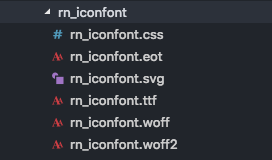

# React Native Icon方案：react-native-svg

网上 React Native 的 icon 实现大都是使用iconfont方案，即：[react-native-vector-icons](https://github.com/oblador/react-native-vector-icons)

此方案存在一个问题：强依赖客户端打包，即每新增图标，就需要客户端重新打包，资源管理上不能做到 RN 与客户端解耦

为了避免这个问题，使用了SVG方案：[react-native-svg](https://github.com/react-native-community/react-native-svg) 来实现Icon

接下来将从三个方面进行分享：

* react-native-svg 使用
* Icon组件实现及2Web
* Icon组件使用

此文会涉及部分 React Native 转 web 的知识，使用的是 react-native-web 方案，可以看看我之前写的文章：[react native转web方案：react-native-web](https://github.com/HuJiaoHJ/blog/issues/9)

## react-native-svg 使用

### 安装

```bash
npm install react-native-svg --save
```

### Link native code

```bash
react-native link react-native-svg
```

以上操作，其实就是将 react-native-svg 的依赖安装到客户端中，进行了上面的操作，基本已自动完成安装依赖，但是在部分IOS上会存在问题，如遇到问题可以去 [react-native-svg](https://github.com/react-native-community/react-native-svg) 查看解决方案

### react-native-svg-uri

[react-native-svg-uri](https://github.com/vault-development/react-native-svg-uri) 支持在RN中通过一个URL或者静态文件渲染svg，同时也支持传入svg字符串，将其渲染

使用如下：

```bash
// 安装
npm install react-native-svg-uri --save
// 确保已在客户端中安装了 react-native-svg 依赖，若未安装依赖，执行：
react-native link react-native-svg
```

下面将使用 react-native-svg-uri 来实现Icon组件，这个库源码只有两个js文件，有兴趣的小伙伴可以自行了解~

### Icon组件实现及2web

#### 实现

上面我们有提到，react-native-svg-uri 支持传入svg字符串来渲染svg，所以可以将多个svg文件通过脚本的形式转换成一个js对象或者一个json文件，其格式如下：

**svg.js**

```JavaScript
export default {
    "arrow-left": "<svg t=\"1533091848499\" class=\"icon\" style=\"\" viewBox=\"0 0 1024 1024\" version=\"1.1\" xmlns=\"http://www.w3.org/2000/svg\" p-id=\"579\" xmlns:xlink=\"http://www.w3.org/1999/xlink\" width=\"32\" height=\"32\"><defs><style type=\"text/css\"></style></defs><path d=\"M769.405 977.483a68.544 68.544 0 0 1-98.121 0L254.693 553.679c-27.173-27.568-27.173-72.231 0-99.899L671.185 29.976c13.537-13.734 31.324-20.652 49.109-20.652s35.572 6.917 49.109 20.652c27.173 27.568 27.173 72.331 0 99.899L401.921 503.681l367.482 373.904c27.074 27.568 27.074 72.231 0 99.899z\" fill=\"\" p-id=\"580\"></path></svg>"
}
```

在使用时，可以通过获取对应 key 的 value 传给 react-native-svg-uri 渲染

上面的转换脚本可以参考：[svg2json](https://www.npmjs.com/package/react-native-svg2json)，代码：[https://github.com/HuJiaoHJ/svg2json](https://github.com/HuJiaoHJ/svg2json)

做好文件转换之后，我们可以开发Icon组件啦

**index.js**

```JavaScript
import createIconSet from './create-icon-set';
// 即上面转换得到的 svg.js
import svg from './svg';

const Icon = createIconSet(svg, 'rn_components');

export default Icon;

export { createIconSet };
```

**creact-icon-set.native.js**

```JavaScript
import React, { Component } from 'react';
import SvgUri from 'react-native-svg-uri';

export default function createIconSet(svg, fontName) {
    return class Icon extends Component {
        render () {
            const { icon, color, size, style } = this.props;
            let svgXmlData = svg[icon];

            if (!svgXmlData) {
                let err_msg = `no "${icon}"`;
                throw new Error(err_msg);
            }
            return (
                <SvgUri width={size} height={size} svgXmlData={svgXmlData} fill={color} style={style} />
            );
        }
    };
}
```

以上就是Icon组件的实现

#### 2web

对RN2web感兴趣的小伙伴可以看看：[react native转web方案：react-native-web](https://github.com/HuJiaoHJ/blog/issues/9)

在此基础上，我们需要对我们Icon组件支持2web，由于没有对应的web组件，所以需要我们自行实现对应web的组件

web端我们使用iconfont来做Icon组件（注意：iconfont不支持多色icon，多色的icon只能选择svg或者img）

还是svg文件转换的问题，我们需要先将svg文件转换成iconfont，即

<p align="left">
    
</p>

这样我们就能向常规web一样使用iconfont啦

上面的转换工具可以参考：[svg2iconfont](https://www.npmjs.com/package/web-svg2iconfont)，代码：[https://github.com/HuJiaoHJ/svg2iconfont](https://github.com/HuJiaoHJ/svg2iconfont)

当然，要注意记得将生成的iconfont.css文件引入页面html中，接下来看看2web的Icon组件实现，不需要额外新建文件夹，只需在相同文件夹下新增 `creact-icon-set.js` 文件（注意到上面RN的文件是 `creact-icon-set.native.js`），这在实际使用过程中，会自动识别这两个文件

**creact-icon-set.js**

```JavaScript
import React, { Component } from 'react'
import { createElement, StyleSheet } from 'react-native'

export default function createIconSet(svgs, fontName) {
  return class Icon extends Component {
    render() {
      const { icon, color, size, style } = this.props
      const styles = StyleSheet.create({
        iconStyle: {
          color,
          fontSize: size,
        },
      })
      const props = {
        className: `${fontName ? fontName + '-' : 'icon-'}${icon}`,
        style: StyleSheet.compose(
          style,
          styles.iconStyle
        ),
      }
      return createElement('i', props)
    }
  }
}
```

如果看了 [react native转web方案：react-native-web](https://github.com/HuJiaoHJ/blog/issues/9) ，应该就能知道 `import { createElement, StyleSheet } from 'react-native'` 实际上是 `import { createElement, StyleSheet } from 'react-native-web'`，没错，就是直接使用的 react-native-web 的 API 来开发转web之后的组件

以上就完成了Icon组件的2web支持

## Icon组件使用

我们怎么使用呢？有两种情况：

### 使用Icon组件自带icon

Icon组件会自带一些常用的icon，在使用这些icon时，使用较为简单，直接引入，如下使用：

```JavaScript
// 引入
import Icon from 'Icon';

// 使用
<Icon icon={'arrow-left'} size={30}/>
```

注意：如果需要支持2web，需要将对应的 `iconfont.css` 引入到页面html中

### 使用业务icon

如果需要添加业务icon，有如下两步:

#### 1、将svg转换成js文件（如需要支持2web，还需生成iconfont）

这部分就不详细讲了，可以参考上面的内容

#### 2、调用 createIconSet 新建 CIcon组件

代码如下：

```JavaScript
import React from 'react'
// 引入Icon组件的 createIconSet 方法
import { createIconSet } from 'Icon'
// 包含业务svg的js文件
import svgs from './svgs'

// 传入业务svg的js对象，生成CIcon组件
const CIcon = createIconSet(svgs)

export default function () {
  return Object.keys(svgs).map((item, index) => (
    // 使用
    <CIcon icon={item} color={'#000'} size={50} key={index} />
  ))
}
```

以上所有代码可在个人开发的RN组件库的项目中查看到：[rn_components](https://github.com/HuJiaoHJ/rn_components)，组件库现在才刚开始建设，后续会不断完善

## 写在最后

以上就是我对 React Native Icon方案：react-native-svg 的分享，希望能对有需要的小伙伴有帮助~~~

喜欢我的文章的小伙伴可以点star ⭐️

欢迎关注 [我的掘金](https://juejin.im/user/56dfa4391532bc00515e13d9/posts)、[我的知乎](https://www.zhihu.com/people/hu-jiao-36-21/posts)