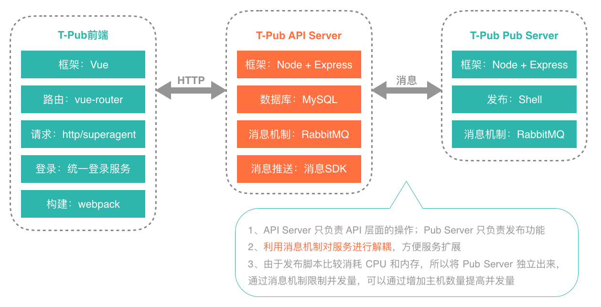

# T-Pub

在前后端分离的大环境下，【T-Pub】服务支持后端自行发布需要的前端测试环境，解决FE工作被打断的问题，同时通过设置git hook，支持当指定分支代码更新时，自动发布测试环境，减少重复发布工作，提高FE工作效率，提升FE工作幸福感

## 背景 & 问题

* 项目前后端分离，前端发布通过脚本（gulp）将静态资源发到CDN上，局限：需要在FE本地执行发布脚本，不支持远程发布
* 公司内部很多B端项目，存在接口单方面的优化，会出现后端频繁找FE发布测试环境，导致FE工作被打断（为什么不固定后端测试环境域名？因为后端统一到测试环境，经常性的存在环境被覆盖的问题，所以在自测阶段，他们采取使用自己申请的主机用于测试😂）
* 测试环境代码不能实时更新，当有新功能上线之后，需要重复发布工作

## 解决

提供【T-Pub】服务，提供以下功能：

* 支持远程发布测试环境（可配置发布设置）
* 通过设置git hook，支持当指定分支代码更新时，自动进行测试环境发布

## 实现

    

通过 [RabbitMQ](https://www.rabbitmq.com/) 将 API Server 和 Pub Server 解耦，方便服务扩展

## 效果

* 人工操作 → 线上实时操作（一次人工操作5min），避免FE工作打断，后端在需要测试环境时，也不用等FE发布了
* 减少重复工作，同时保证测试环境代码的实时更新
* 支持后端能够直接操作来发布需要的前端测试环境